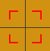

## 1.创建JFrame框架窗口类
1. 创建FiveToFive类（extends JFrame），对窗口进行样式完善。
主要体现为：

    ```java
    this.setSize(620,670);//设置窗口大小
    this.setLocationRelativeTo(null);//窗口的初始位置居中
    this.setResizable(false);//不允许窗口变大变小，防止尺寸bug
    //this.setVisible(true);
    this.setDefaultCloseOperation(EXIT_ON_CLOSE);//用于设置JFrame的默认关闭操作
    this.getContentPane().setBackground(new Color(209,146,17));//当前JFrame的内容容器，设置RGB颜色，如JPanel

    ```

## 2.创建Start类
+ 用于启动，存放main函数
+ 注意`GamePanel panel=new GamePanel(five);`传入了窗口到面板，方便后续在GamePanel类中对菜单进行创建和操作，JMenuBar在panel之外。

## 3.创建GamePanel类
1. `extends JPanel  implements ActionListener`，接入监听器
2. **对于创建的变量分析**：
   + `private GamePanel gamePanel;`用于后续当鼠标点击时，方便为AI函数传参
        ```java
        if(AI.has5(pointer,gamePanel)){
            gameWIN();
        }else {
                AI.next(gamePanel);//AI接口
                }
        ```
   
   + 一些存储变量
   
        ```java
        //存棋子(类似vector)
        public ArrayList<Chess> chess_s=new ArrayList<>();
        //创建指示器二维数组
        public Pointer [][]pointers=new Pointer[ROWS_size][COLS_size]; 
        ```

   + 其他：
        ```java
        public static final int ROWS_size=15;//行数
        public static final int COLS_size=15;//列数
        private String gameFlag="start";//游戏状态
        private JMenuBar jmb=null;//创建菜单栏
        private FiveToFive mainFrame=null;//传入窗口参数给此变量
        
        ```

3. **构造函数的使用**
   1. 传入参数`FiveToFive mainFrame`，赋给已经在GamePanel类中创建的`gamePanel`
   2. JPanel的基础设置：
        ```java
        this.setLayout(null);//设置布局管理器，null为手动指定组件的位置和大小
        this.setOpaque(false);//设置面板为透明的
        this.mainFrame=mainFrame;//传参 
        ```
   3. 以下是自定义函数的调用
        ```java
        //初始化图片
        ImageValue.init();//此处需再构造一个ImageValue类，在下方
        //创建菜单
        createMenu();
        //创建指示器
        createPointers();
        //创建鼠标监听
        createMouseListener();
        ``` 

4. **函数**
   1. 创建菜单项
        + 主干：
           ` JMenuBar JMenu JMenuItem `
        + 细节：
          + ```java
            //创建当前字体
            Font curFont=creatFont();//creatFont为自定义在本类中
            //设置菜单选项字体
            JMenu1.setFont(curFont);
            JMenu2.setFont(curFont);
            //设置下拉框字体
            jmi1.setFont(curFont);
            jmi2.setFont(curFont);
            jmi3.setFont(curFont);
            jmi4.setFont(curFont);
            
          + ```java
            private Font creatFont(){
                return new Font("思源宋体",Font.BOLD,18);
            }//参数分别为Family 粗细 Size
          +  `this.mainFrame.setJMenuBar(jmb);`
        + 监听器
            ```java
            //监听器
            jmi1.addActionListener(this);//参数为面板
            jmi2.addActionListener(this);
            jmi3.addActionListener(this);
            jmi4.addActionListener(this);
            //设置指令
            jmi1.setActionCommand("restart");
            jmi2.setActionCommand("exit");
            jmi3.setActionCommand("help");
            jmi4.setActionCommand("win");
            ```

   2. 菜单项命令的实现
        ```java
        //被点击后的行动函数表现，四条命令
        @Override//重写
        public void actionPerformed(ActionEvent e) {
        String command=e.getActionCommand();//捕获行动的函数
        //System.out.println(command);
        //调用了类函数，字体设置
        UIManager.put("OptionPane.buttonFont",new FontUIResource(new Font("思源宋体",Font.ITALIC,18)));//设置按钮字体//仅退出时使用
        UIManager.put("OptionPane.messageFont",new FontUIResource(new Font("思源宋体",Font.ITALIC,18)));//设置信息字体
        //这个方法用于为UI管理器设置默认属性。在这个例子中，它设置了"OptionPane.buttonFont"属性。
        if("exit".equals(command)){//第一条
            Object[]options={"确定","取消"};
            int response=JOptionPane.showOptionDialog(this,"你真的","",
                    JOptionPane.YES_OPTION,JOptionPane.QUESTION_MESSAGE,null,options,options[0]);//注意参数
            if(response==0){
                System.exit(0);
            }
        } else if ("restart".equals(command)) {//第二条
            if(!"end".equals(gameFlag)){
                JOptionPane.showMessageDialog(null,"正在游戏中","提示",JOptionPane.INFORMATION_MESSAGE);
            
        }else{
            restart();}//指示器重置，棋子数组重置
        }else if ("help".equals(command)){//第三条
            JOptionPane.showMessageDialog(null,"五子棋还要","这里是",JOptionPane.INFORMATION_MESSAGE);
        }else if ("win".equals(command)){//第四条
            JOptionPane.showMessageDialog(null,"连成","提示",JOptionPane.INFORMATION_MESSAGE);
        }

        }
        ```        
   4. 创建指示器，作用为悬浮提示
   
    需要调用Pointer类，对pointer完成初始化，确定每个pointer的物理位置x,y

   5. 绘画部分
        ```java
        //JComponent中的函数
        //为自动调用在Panel中
        //注意绘制函数都在此函数中被调用
        @Override
        public void paint(Graphics g) {
        super.paint(g);
        //绘制网格
        drawGrid(g);
        //绘制黑点
        draw5points(g);
        //绘制指示器
        drawPointers(g);
        //绘制棋子
        drawChess(g);
        }
        ``` 

## 4.创建棋子类及对应的图片加载类
1. 棋子用type记录黑棋或白棋
2.  ```java
    //图片加载
    public class ImageValue {
        public static BufferedImage image1=null;
        public static BufferedImage image2=null;
        //图片路径
        //注意为static
        private static String  path="/images/";
        //初始化图片方法
        public static void init(){
            try{
                image1= ImageIO.read(ImageValue.class.getResource(path+"img1.png"));
                image2= ImageIO.read(ImageValue.class.getResource(path+"img2.png"));
            }catch (Exception e){
                e.printStackTrace();//图片加载报错
            }
        }
    }
    